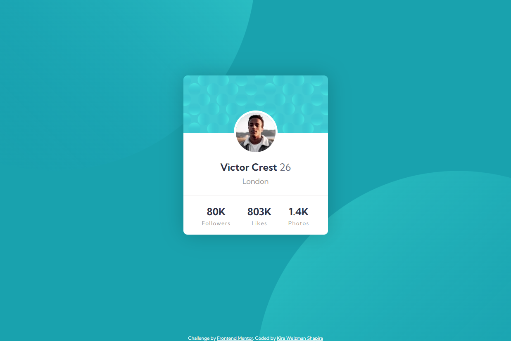

# Frontend Mentor - Profile card component

### Welcome! 👋

Thanks for checking my solution code to the [Profile card component challenge on Frontend Mentor](https://www.frontendmentor.io/challenges/profile-card-component-cfArpWshJ).

In my learning process I found that positioning the avatar profile's card isn't as simple as I thought. There are several methods here to achieve this, and I'm not sure I used one correctly, although it comes out responsive in different screens.

```css
.profile-photo {
  position: relative;
  margin-top: 140px;
  display: flex;
  justify-content: center;
}

.profile-photo img {
  position: absolute;
  top: -55px;
  border-radius: 100%;
  border: 5px solid var(--white);
}
```

The same in the process of creating a dividing line, I wasn't sure how to create a full line without the padding attribute affecting it. So I tried this solution:

```javascript
<div class="profile-container-top">...</div>
<div class="divider"></div>
<div class="profile-container-bottom">...</div>
```

```css
.divider {
  border-top: 1px solid hsl(0, 5%, 92%);
}
```

Special thanks to [@debriks](https://www.frontendmentor.io/solutions/profile-card-component-Ho8w8c0PUC) for her solution how to create body background with images.



### Built with

- Semantic HTML5 markup
- CSS custom properties
- Flexbox
- Desktop-first workflow

## Author

Coded by <a href="https://www.frontendmentor.io/profile/kirawesh">@kirawesh</a>